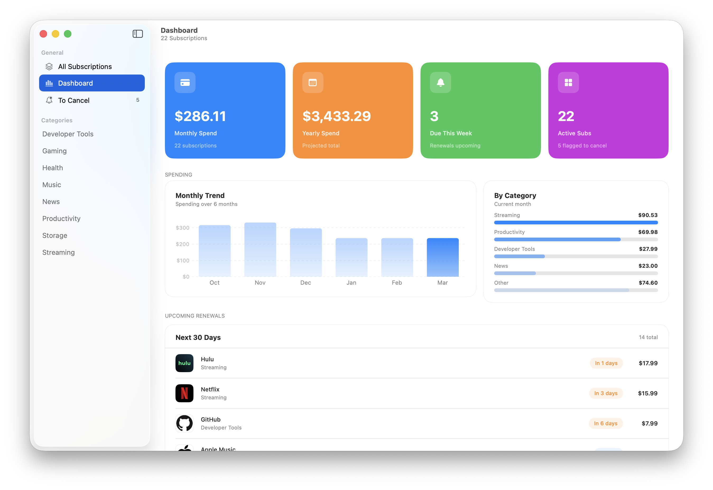
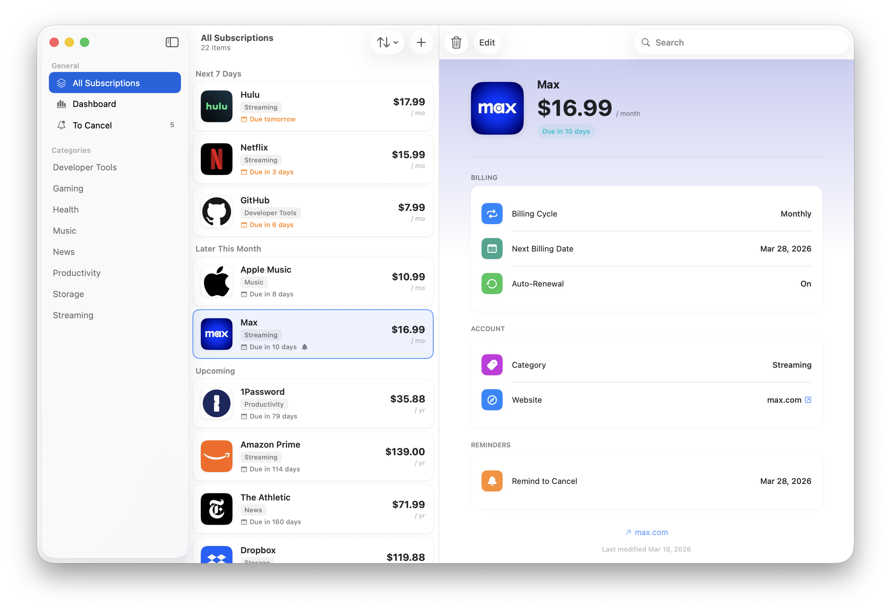
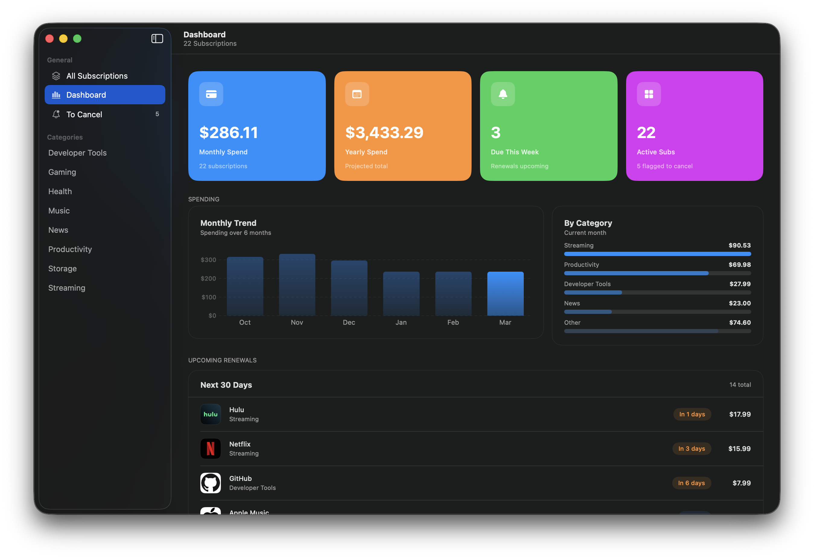
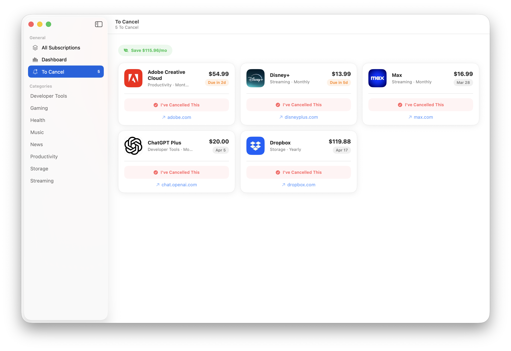
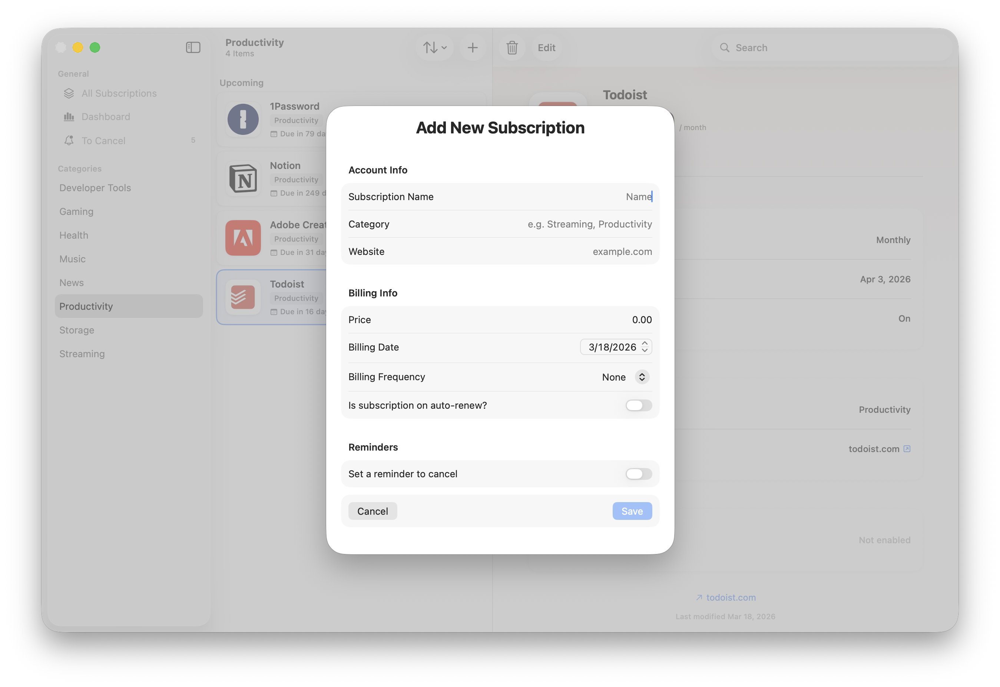
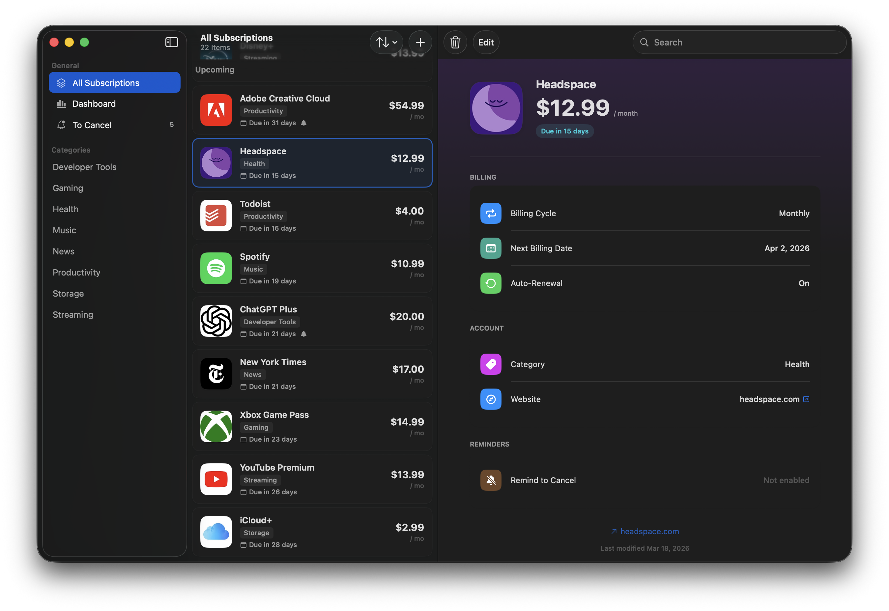

# Supscription

A native subscription tracker for Apple platforms. No bank linking, no third-party dependencies — just a clean way to manage recurring subscriptions.

Built with SwiftUI and SwiftData. Everything stays on your device.

---



---

## Overview

Supscription lets you manually log and manage your recurring subscriptions. It's designed to be simple, private, and native to macOS — with iOS support in progress.

Most subscription trackers want access to your bank. This one doesn't. Enter your subscriptions, see what's coming up, get reminded before you're charged.

---

## Screenshots

| All Subscriptions — Light | Dashboard — Dark |
|---|---|
|  |  |

| To Cancel | Add Subscription |
|---|---|
|  |  |



---

## Features

- **Dashboard** — monthly and annual spend, active count, 6-month spending trend, and upcoming renewals
- **To Cancel** — watchlist of subscriptions flagged to cancel with urgency badges and direct cancel links
- **Inline editing** — edit details directly in the detail view
- **Reminders** — billing and cancel reminders with frequency-aware defaults
- **Category management** — drag-and-drop between categories, rename and delete via context menu
- **Logo fetching** — automatic logo lookup by domain with local caching
- **Theme support** — Light, Dark, and System

---

## Tech Stack

- **Language:** Swift
- **UI:** SwiftUI
- **Data:** SwiftData (local persistence, iCloud sync via CloudKit)
- **Charts:** Swift Charts
- **Platforms:** macOS (shipping), iOS (in development)
- **Dependencies:** None — no third-party libraries

---

## Project Structure

```
Shared/              Cross-platform models, services, and utilities
Supscription/        macOS app target
Supscription iOS/    iOS app target
```

---

## Requirements

- macOS 15.0+
- iOS 18.0+
- Xcode 16+

---

## Building

1. Clone the repository
2. Open `Supscription.xcodeproj` in Xcode
3. Select the **Supscription** scheme (macOS) or **Supscription iOS** scheme (iOS)
4. Build and run

> **Note:** A `Shared/Secrets.plist` file with a `LOGO_API_TOKEN` key is required for logo fetching. The app will build without it, but logo lookup will be disabled.

---

## Roadmap

- iOS app (in progress)
- On-device AI category suggestions via Apple Intelligence
- Predictive spending analytics
- CSV and JSON export

---

## License

This project is not currently open source. All rights reserved.

---

Built by [Ricardo Flores](https://github.com/imrichie)
