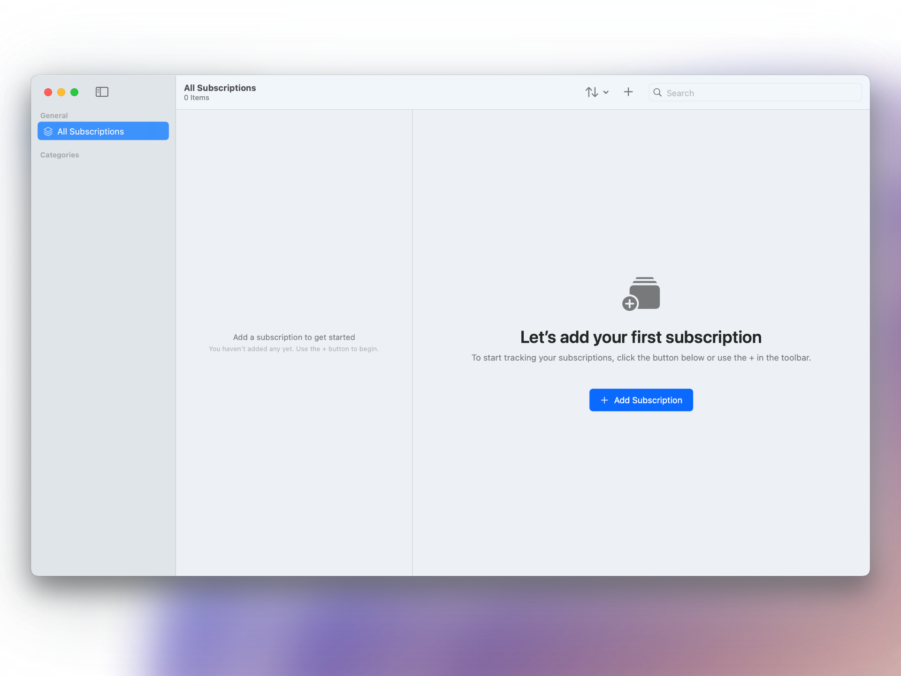

# 📦 Supscription

**Supscription** is a macOS application for manually tracking recurring subscriptions.

> Built with SwiftUI, SwiftData, and a focus on simplicity, and real-world usability.

---

## 📖 About This Project

Supscription started from a simple idea:  
many subscription tracking apps are either overcomplicated, require linking sensitive financial accounts, or bundle tracking into larger financial management suites.

The goal was to create a focused, distraction-free alternative — something that respects the user’s desire for control, simplicity, and privacy.

This project was designed, developed, and refined independently over the course of several months.  
It involved considering not only technical architecture, but also user experience, interactions, and the small decisions that make a tool feel reliable over time.

#### Intentions

> This project was created as part of a personal goal to build, refine, and deliver a full product cycle — from idea to execution — using modern Apple development practices.

---

## 🎯 Goals

The goal of Supscription was to create a simple tool for managing recurring subscriptions without the need for complex financial integrations. The focus was on helping users manually track their subscriptions, set reminder notifications before billing dates, and maintain visibility into recurring costs without account creation, data scraping, or unnecessary friction. The user experience was designed to feel immediate, predictable, and sustainable over long-term use.

## ✨ Core Features

- **Subscription Management** 
  Add, edit, and delete subscriptions with key details such as name, price, billing date, and category.
- **Reminder Notifications** 
  Set a custom reminder date to receive a notification before a subscription renews.

- **Category Organization** 
  Assign categories to subscriptions for easy grouping and sidebar navigation.

- **Search & Sort** 
  Quickly find subscriptions with a built-in search bar and sort them by name, price, billing date, or category.

- **Local Data Persistence** 
  All subscription data is saved securely on the device using SwiftData, with no external syncing required.

- **System Integration** 
  Supports macOS features like dark mode, menu commands, keyboard shortcuts, and native notification delivery.

## 🛠️ How It Was Built

Supscription was developed with a focus on respecting macOS platform conventions, maintaining a lean architecture, and minimizing long-term maintenance complexity. Key technical decisions were made to prioritize stability, user trust, and future extensibility.

Key implementation details included:

- Built in **Swift** using **SwiftUI** for the interface and **SwiftData** for local data persistence.
- Notification scheduling handled via **UNUserNotificationCenter**, with safeguards for edge cases such as past dates and timezone differences.
- Adopted macOS design patterns like **NavigationSplitView** and **CommandGroups** to fully support keyboard shortcuts and menu integrations.
- Emphasized **predictable application behavior** over feature expansion, aiming for a focused, sustainable user experience.

## 💡 Design and UX Considerations

The design approach for Supscription prioritized clarity, predictability, and adherence to Apple's **Human Interface Guidelines (HIG)**. Rather than inventing new patterns, the app focuses on fitting naturally into expected system behaviors while minimizing friction.

Key considerations included:

- Using smart defaults (such as 9:00 AM reminder times) to reduce decision-making overhead for users.
- Supporting optimistic interactions, assuming positive user intent without excessive confirmation prompts.
- Maintaining momentum by avoiding heavy onboarding flows, redundant alerts, or unnecessary modal interruptions.
- Providing fallback states when optional user data is missing (e.g., displaying placeholder logos or category labels).
- Aligning with macOS conventions for lightweight navigation, focus management, system toolbar integration, and subtle use of animation.

> Rather than aiming for maximum feature count, the focus remained on delivering a thoughtful, usable tool — one that feels complete in its scope without demanding more from the user than necessary.

## 📚 Lessons and Iterations

Building Supscription highlighted several platform-specific challenges and design decisions that shaped the final product. Throughout development, the emphasis stayed on respecting user expectations, maintaining consistency with system behavior, and adapting to the evolving toolset.

Key lessons included:

- Designing for macOS is fundamentally different from iOS — desktop mental models around windows, sidebars, and focus state required deliberate consideration.
- Early use of SwiftData surfaced evolving behaviors in model syncing, context management, and migration handling.
- Notifications on macOS behave subtly differently from iOS, requiring close attention to permission states, scheduling nuances, and user expectations around timing.
- Refining the balance between user control and smart defaults was crucial; every unnecessary prompt or friction point had measurable impact on the overall flow.

---

## 🚀 Future Roadmap

- **Spending Visualization** 
  Integrate **SwiftCharts** to show total subscription costs and trends over time.

- **iCloud Sync** 
  Enable seamless backup and access to subscription data across multiple Apple devices.

- **CSV/PDF Export** 
  Allow users to export their subscription list for personal record-keeping or sharing.

- **Cross-Platform Development** 
  Extend Supscription to iPhone and iPad with a native SwiftUI implementation.

- **App Store Release** 
  Refine and publish Supscription to the **App Store**.

---

## 📸 Screenshots

A selection of key views from Supscription, showing onboarding, subscription management, and UI adaptations like dark mode.

|                 Welcome Sheet                 |                Empty State                |                Main View                |
| :-------------------------------------------: | :---------------------------------------: | :-------------------------------------: |
|  |  |  |

|               Add View                |                Dark Mode                |                   Empty Detail                    |
| :-----------------------------------: | :-------------------------------------: | :-----------------------------------------------: |
|  |  |  |
